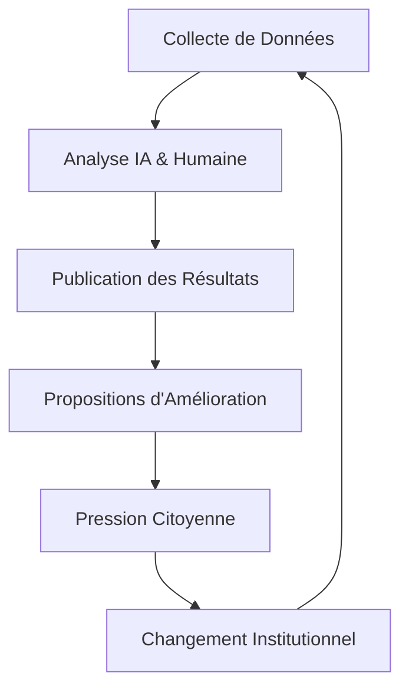

# AI France Revolution 🇫🇷 🔍 🛡️

  

**Reprenez le Contrôle de VOS Institutions**
  
*Transparence • Analyse • Action Collective*

[Notre Mission](#notre-mission) •
[Nos Analyses](#nos-analyses-budgétaires) •
[Nos Outils](#nos-outils) •
[Participer](#comment-participer) •
[Projets](#projets-open-source) •
[FAQ](#faq)

## Notre Mission

**AI France Revolution** utilise l'intelligence artificielle et la data science pour rétablir la transparence des institutions françaises et redonner le pouvoir aux citoyens. Nous réalisons des analyses budgétaires rigoureuses et des études d'amélioration qui démystifient le fonctionnement de l'État et ses services.

> *Vous sentez-vous impuissant face à l'opacité administrative? Frustré de ne pas savoir où vont vos impôts? AI France Revolution vous donne enfin les moyens de percer les barrières d'information qui vous concernent directement.*

## 📊 La Situation Actuelle

| Indicateur | Statistique | Impact |
|------------|-------------|--------|
| **Impôts** | ~57% du PIB | Vos impôts sont engloutis sans traçabilité claire |
| **Dette** | > 3 100 Mds€ | Une facture que vous et vos enfants paierez pendant des décennies |
| **Prélèvements** | ~44% | Près de la moitié de vos revenus disparaît dans le système |
| **Démarches** | 1 600+ formulaires | Conçus pour épuiser votre patience |
| **Fonctionnaires** | ~5.7 Millions | Dont vous ne savez pas qui fait quoi |
| **Données Publiques** | 65 000+ jeux de données | Théoriquement accessibles mais pratiquement inutilisables |

## 🔬 Nos Analyses Budgétaires

Notre équipe d'analystes et data scientists réalise des études détaillées pour:

- ✅ Décomposer les dépenses publiques par secteur
- ✅ Évaluer l'efficacité des investissements publics
- ✅ Cartographier les flux financiers entre institutions
- ✅ Détecter les anomalies et dépenses injustifiées
- ✅ Modéliser les conséquences fiscales à long terme
- ✅ Comparer la performance budgétaire à l'international

## 🛠️ Nos Outils

<table>
  <tr>
    <td align="center"><h3>🔍</h3></td>
    <td><b>Décodeur de Jargon Administratif</b> Notre IA traduit en langage clair tout document ou réglementation qui vous concerne.</td>
  </tr>
  <tr>
    <td align="center"><h3>📊</h3></td>
    <td><b>Visualisateur de Données Budgétaires</b> Transformez des chiffres incompréhensibles en visualisations interactives qui révèlent où va votre argent.</td>
  </tr>
  <tr>
    <td align="center"><h3>💬</h3></td>
    <td><b>Amplificateur de Voix Collective</b> Votre expérience, combinée à celles de milliers d'autres, devient une force de changement.</td>
  </tr>
  <tr>
    <td align="center"><h3>🧠</h3></td>
    <td><b>Comparateur Discours vs Réalité</b> Identifiez les contradictions entre promesses politiques et mesures réelles.</td>
  </tr>
  <tr>
    <td align="center"><h3>🔐</h3></td>
    <td><b>Plateforme de Témoignage Sécurisée</b> Partagez vos expériences en toute sécurité.</td>
  </tr>
  <tr>
    <td align="center"><h3>🌐</h3></td>
    <td><b>Simulateur d'Impact Personnel</b> Comprenez comment chaque décision publique affecte directement votre situation.</td>
  </tr>
</table>

## 📈 Notre Processus de Transformation

## 💻 Projets Open Source

Tous nos projets sont open source et ouverts à la contribution:

| Projet | Description | Liens |
|--------|-------------|-------|
| **Afd** | Analyse des flux de l'Agence Française de Développement | [Code](https://github.com/Association-AI-France-Revolution/afd) • [Site](https://afd.aifr.fr) |
| **Subventions-ADEME** | Transparence des subventions environnementales | [Code](https://github.com/Association-AI-France-Revolution/subventions-ademe) • [Site](https://ademe.aifr.fr) |
| **Budget-Tracker** | Visualisation interactive du budget de l'État | [Code](https://github.com/Association-AI-France-Revolution/budget-tracker) |

➡️ [Voir tous nos projets sur GitHub](https://github.com/Association-AI-France-Revolution)

## 🤝 Comment Participer

Chacun peut contribuer à notre mouvement, selon ses moyens, ses compétences et sa disponibilité:

### Pour Tous:
- ✅ Suivre nos réseaux sociaux pour amplifier notre portée
- ✅ Partager nos analyses dans votre entourage
- ✅ Vous informer sur les enjeux de transparence
- ✅ Témoigner de vos expériences administratives

### Pour les Développeurs:
- ✅ Contribuer à nos projets open source
- ✅ Proposer des améliorations techniques
- ✅ Participer à nos hackathons de la transparence
- ✅ Créer de nouveaux outils d'analyse de données publiques

### Pour les Data Scientists:
- ✅ Participer à nos analyses techniques
- ✅ Développer des modèles prédictifs
- ✅ Valider nos méthodologies d'analyse
- ✅ Former notre communauté à l'analyse de données

## 🌐 Rejoindre la Communauté

  

## 📋 Comment Contribuer au Code

1. Fork le projet
2. Créer une branche pour votre fonctionnalité (`git checkout -b feature/amazing-feature`)
3. Commit vos changements (`git commit -m 'Add some amazing feature'`)
4. Push vers la branche (`git push origin feature/amazing-feature`)
5. Ouvrir une Pull Request

Consultez notre [guide de contribution](CONTRIBUTING.md) pour plus de détails.

## 📑 FAQ

<b>Est-ce que AI France Revolution répond vraiment à ma frustration quotidienne?</b>

Absolument. Notre plateforme combine analyses budgétaires rigoureuses, études d'amélioration des services publics et outils de compréhension pour vous donner enfin une vision claire du système qui vous impacte quotidiennement.

<b>En quoi vos analyses sont-elles différentes des informations officielles?</b>

Contrairement aux publications gouvernementales fragmentées et techniques, nos analyses relient les données entre elles, révèlent les incohérences, et traduisent la complexité en insights actionnables pour votre situation personnelle.

<b>Je n'ai pas de compétences techniques. Puis-je quand même participer?</b>

Absolument! Même un simple partage de nos contenus ou un abonnement à nos réseaux sociaux renforce notre impact collectif. Vous pouvez également contribuer en témoignant de vos expériences administratives.

<b>Comment garantissez-vous l'objectivité de vos analyses?</b>

Notre méthodologie repose sur la transparence totale: toutes nos sources sont citées, nos calculs sont vérifiables et notre code est open-source. Nous appliquons des standards rigoureux de data science et soumettons nos analyses à la revue par les pairs.

## 📞 Contact

Pour toute question ou proposition de collaboration:
- 📧 Email: contact@aifr.fr
- 💬 Telegram: [IAFranceRevolution_bot](https://t.me/IAFranceRevolution_bot)

## 📄 Licence

Ce projet est sous licence [MIT](LICENSE) - voir le fichier LICENSE pour plus de détails.

---

**© 2025 - Association AI France Revolution. Tous droits réservés.**

*Transformez votre frustration en action collective. Rejoignez-nous.*

